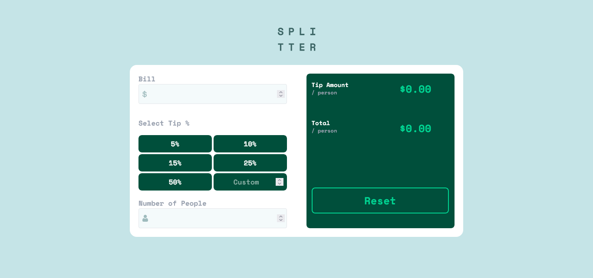
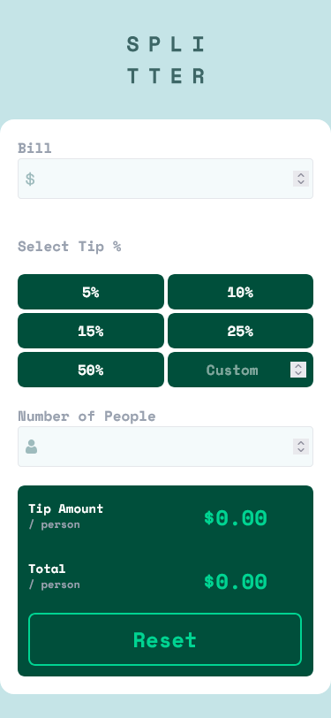

# Frontend Mentor - Tip calculator app solution

This is a solution to the [Tip calculator app challenge on Frontend Mentor](https://www.frontendmentor.io/challenges/tip-calculator-app-ugJNGbJUX). Frontend Mentor challenges help you improve your coding skills by building realistic projects.

## Table of contents

- [Overview](#overview)
  - [The challenge](#the-challenge)
  - [Screenshot](#screenshot)
  - [Links](#links)
- [My process](#my-process)
  - [Built with](#built-with)
  - [Useful resources](#useful-resources)
- [Author](#author)

## Overview

### The challenge

Users should be able to:

- View the optimal layout for the app depending on their device's screen size
- See hover states for all interactive elements on the page
- Calculate the correct tip and total cost of the bill per person

### Screenshot

### Links

- Solution URL: [Solution URL](https://www.frontendmentor.io/solutions/responsive-tip-calculator-using-tailwind-EiGjakBuwc)
- Live Site URL: [Live site URL]( https://r1v3ra-1508.github.io/tip-calculator-app-main)

### Built with

- Semantic HTML5 markup
- CSS custom properties
- Flexbox
- CSS Grid
- Mobile-first workflow
- [Tailwind](https://tailwindcss.com) - For styles

### Useful resources

- [DuckDuckGo](https://www.duckduckgo.com) - I dont know what i will do without duck.
- [Deepseek AI](https://www.chat.deepseek.com) - He gave me some advices about Javascript.
- [Tailwind Docs](https://tailwindcss.com/docs) - Just Tailwind docs.

## Author

- Github - [r1v3ra-1508](https://www.github.com/r1v3ra-1508)
- Frontend Mentor - [@r1v3ra-1508](https://www.frontendmentor.io/profile/r1v3ra-1508)
